# NetWorth Tracker - Your Local Investment Manager

[](https://openjdk.org/)
[](https://spring.io/projects/spring-boot)
[](https://react.dev/)
[](https://flutter.dev/)
[](https://www.postgresql.org/)
[](https://redis.io/)
[](LICENSE)
[](http://makeapullrequest.com)
[]()
[](https://llama.meta.com/)

A self-hosted personal finance platform built for Indian investors. Track equity, mutual funds, EPF, PPF, NPS, gold, crypto, real estate, FDs, bonds, and bank balances in one place with live market data, net-worth analytics, AI insights, tax computation, and family aggregation.

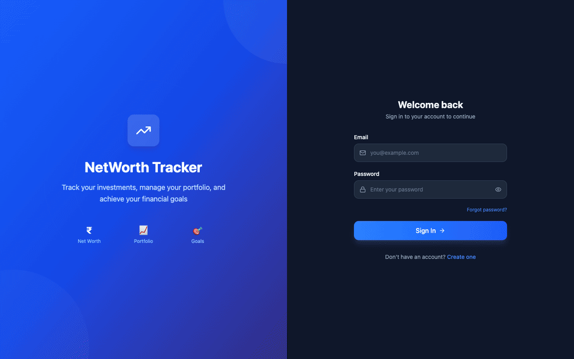

---

## Table of Contents

- [Screenshots](#screenshots)
- [Features](#features)
- [Quick Start](#quick-start)
- [Demo Account](#demo-account)
- [How to Use](#how-to-use)
- [Architecture](#architecture)
- [Tech Stack](#tech-stack)
- [Configuration](#configuration)
- [Market Data Providers](#market-data-providers)
- [API Reference](#api-reference)
- [Database Migrations](#database-migrations)
- [Building & Deployment](#building--deployment)
- [License](#license)

---

## Screenshots

| Dashboard | Holdings | Net Worth |
|:---------:|:--------:|:---------:|
| 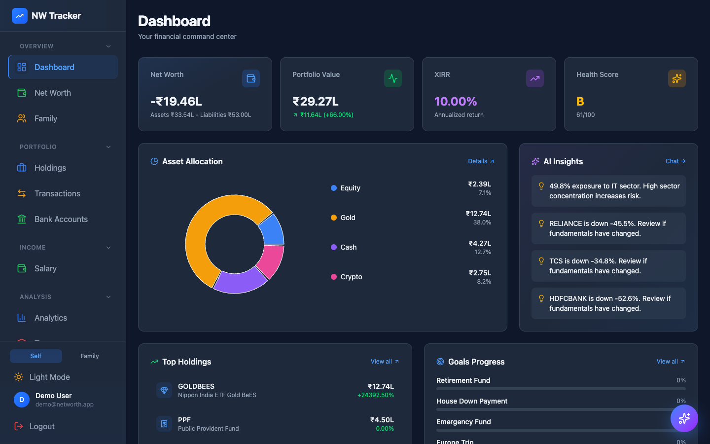 | 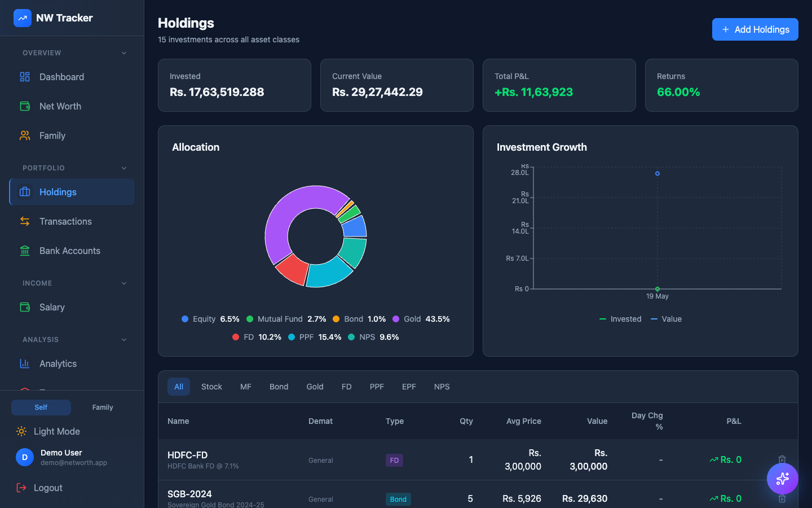 | 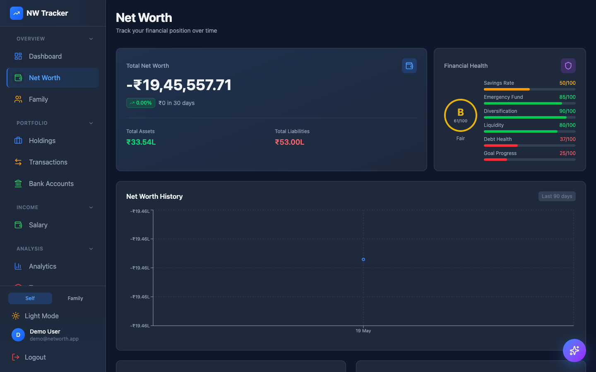 |

| Analytics | Goals | Liabilities |
|:---------:|:-----:|:-----------:|
| 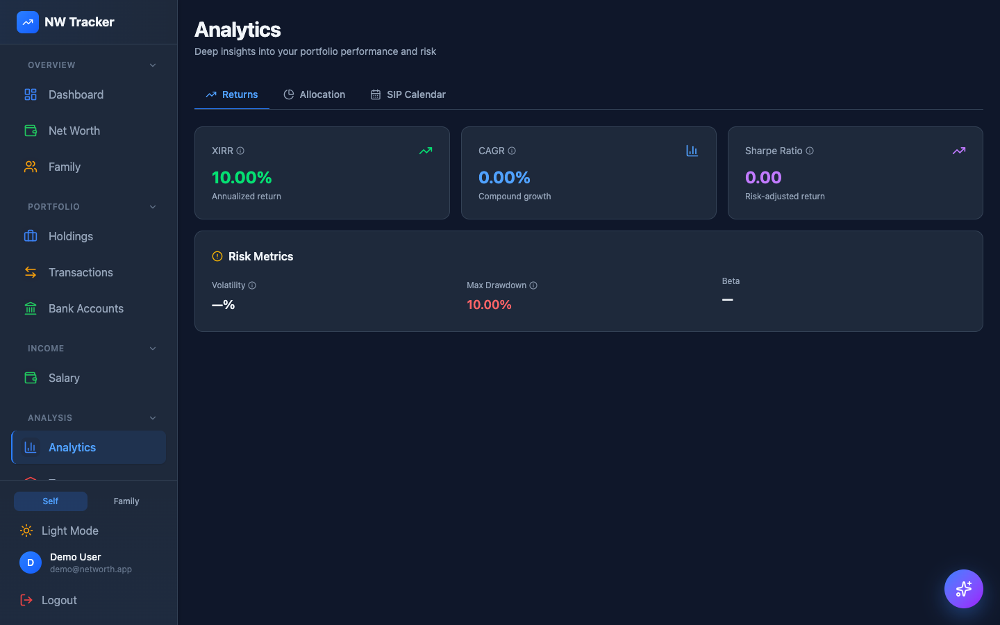 | 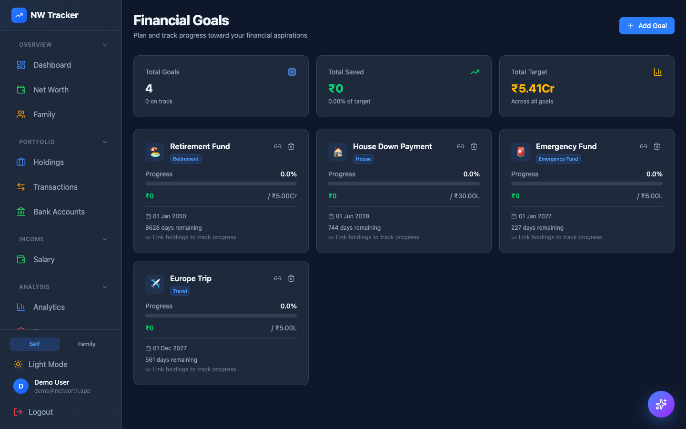 | 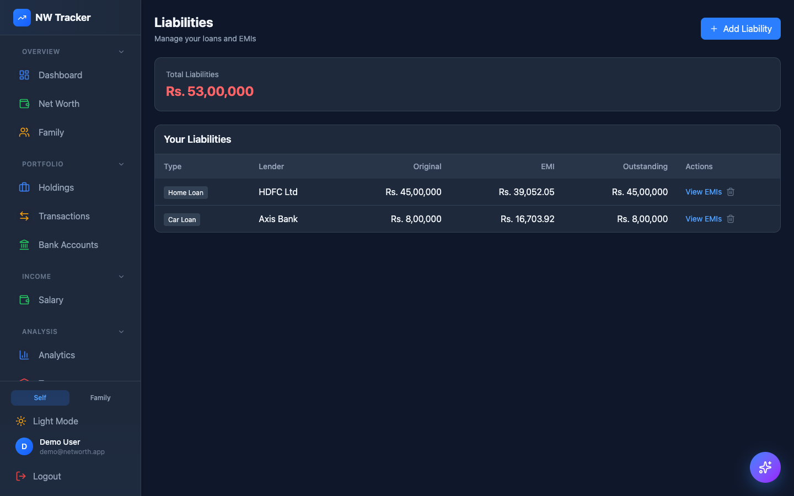 |

| AI Chat | Tax | Bank Accounts |
|:-------:|:---:|:-------------:|
| 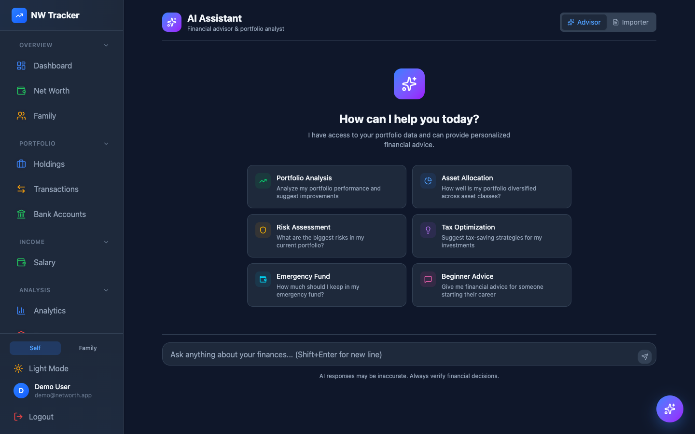 | 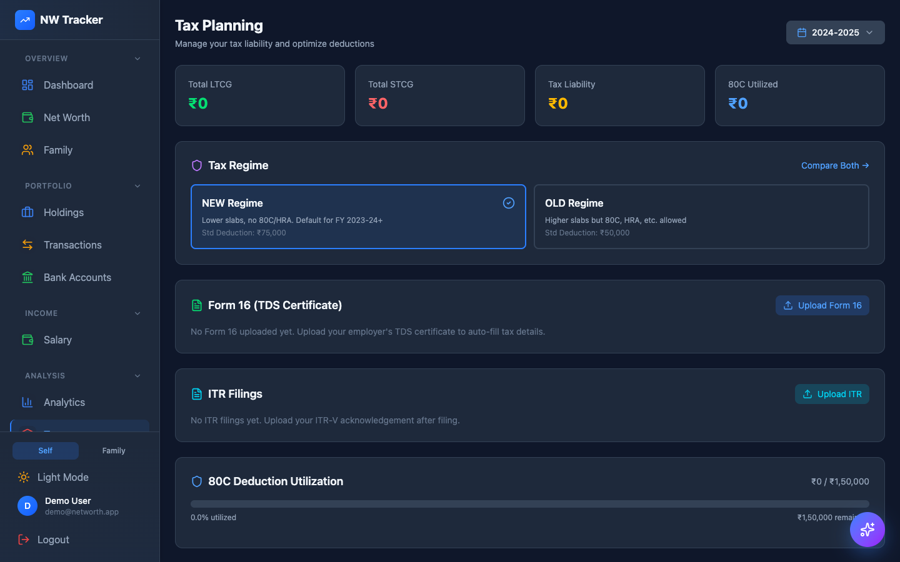 | 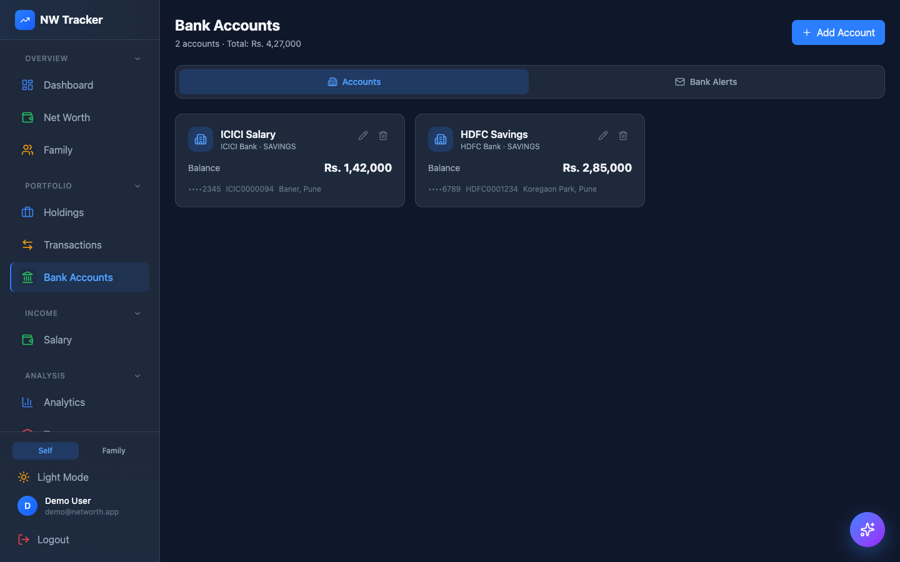 |

| Salaries | Transactions | Family |
|:--------:|:------------:|:------:|
| 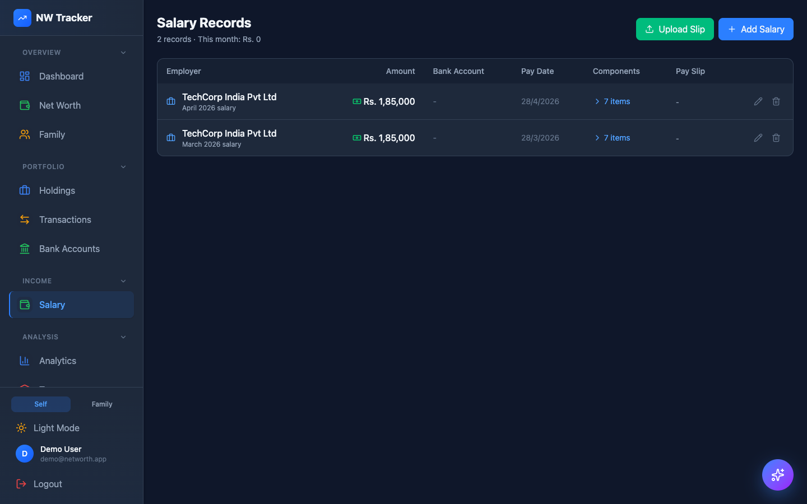 | 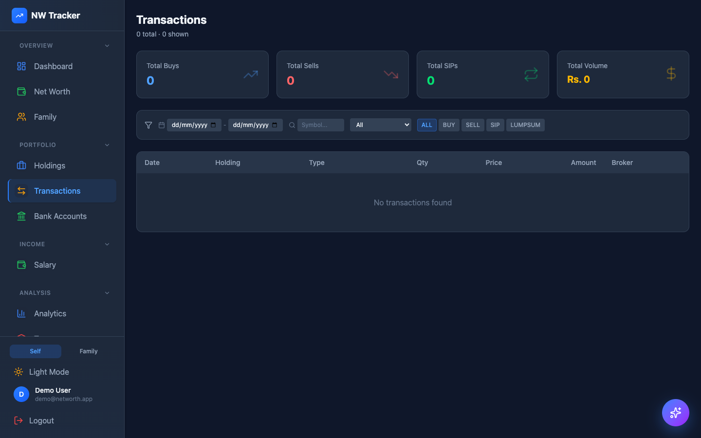 | 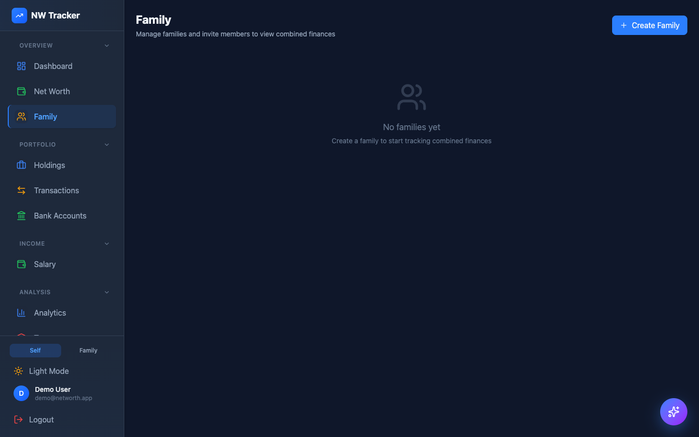 |

| Login | Demat Accounts | Profile & Themes |
|:-----:|:--------------:|:----------------:|
| 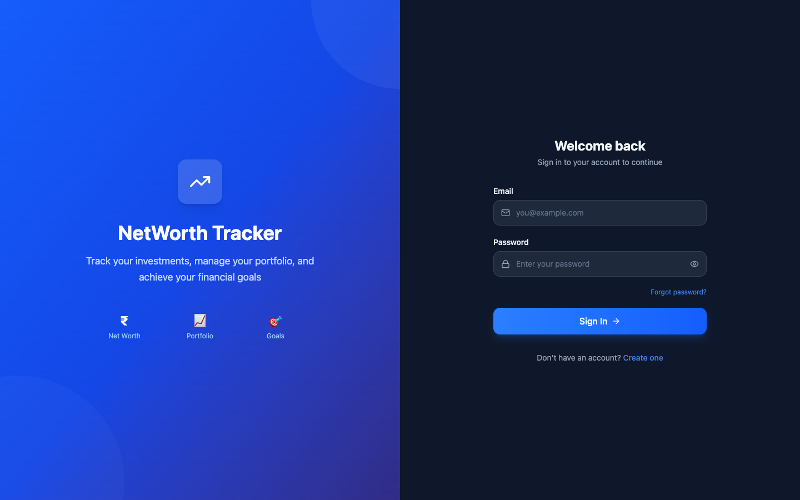 | 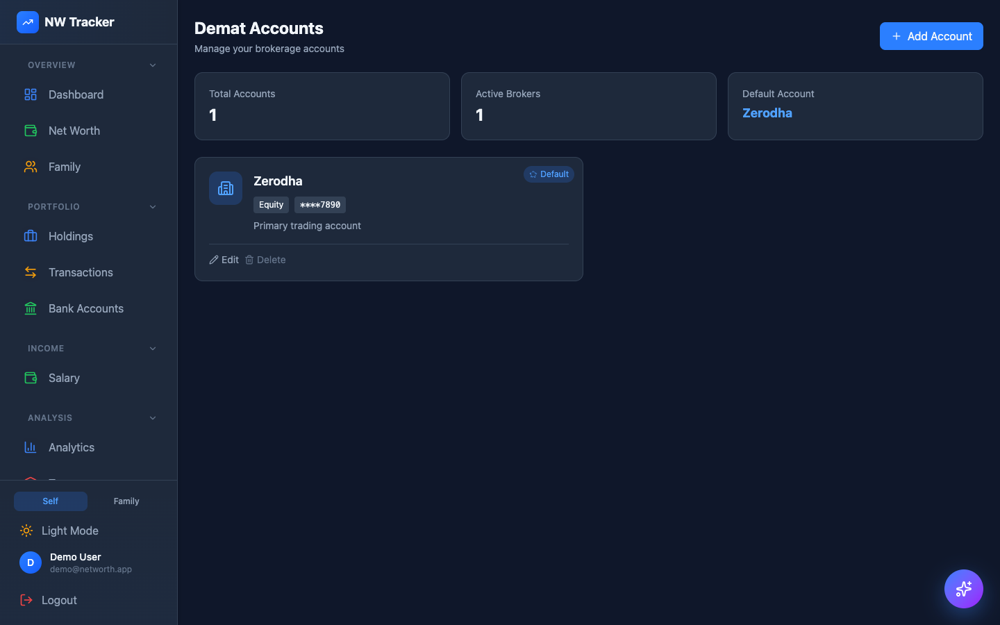 | 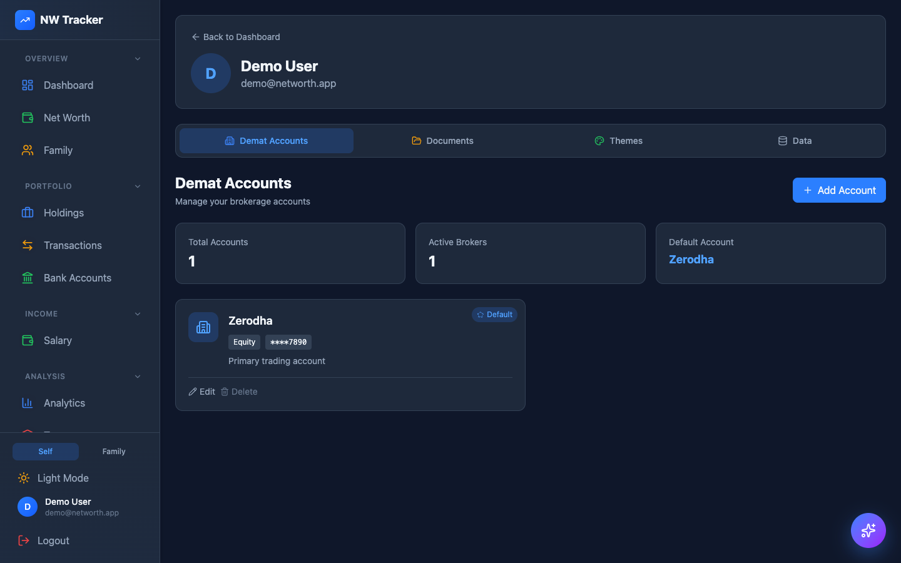 |

---

## Features

### Portfolio Tracking
- **Multi-asset support** — Equity, Mutual Funds, ETFs, Bonds, Gold, Crypto, Real Estate, EPF, PPF, NPS, FDs, SGB, Cash
- **Live market prices** — Pluggable provider framework with configurable fallback chains (Upstox, Yahoo Finance, Alpha Vantage, AMFI, NSE)
- **Interactive price charts** — Click any holding to view OHLC candlestick charts with 1M/3M/6M/1Y periods
- **Demat account management** — Link holdings to broker demat accounts; account numbers are masked in the UI
- **Broker sync** — OAuth-based Upstox integration to auto-import holdings (feature-flagged)
- **ISIN auto-resolution** — Automatically resolves ISIN from NSE symbol database at holding creation

### Net Worth & Analytics
- **Real-time net worth** — Aggregates all assets minus liabilities with daily history snapshots
- **Financial health score** — 6 weighted dimensions (Emergency Fund, Debt Health, Savings Rate, Diversification, Liquidity, Goal Progress) with letter grades and actionable recommendations
- **Investment growth chart** — Area chart comparing invested amount vs current value over time
- **Multi-asset allocation** — Pie chart showing portfolio distribution across asset types
- **XIRR & CAGR** — Per-holding and portfolio-level return calculations
- **Sector allocation** — Sector-wise breakdown for equities

### Tax & Compliance
- **Tax regime comparison** — Side-by-side Old vs New regime computation
- **LTCG/STCG calculation** — Automatic capital gains computation based on holding period
- **Tax harvesting suggestions** — Identifies loss-booking opportunities
- **Section 80C tracking** — Monitors 80C-eligible investments against the 1.5L limit

### Goals & Planning
- **Goal tracking** — Set financial goals (retirement, house, education, emergency, travel, etc.) with target amounts and dates
- **Holding linking** — Map holdings to goals with allocation percentages; progress auto-updates daily
- **Risk profiling** — Conservative, moderate, or aggressive risk profiles per goal
- **Rebalancing suggestions** — Drift detection from target allocation

### Liabilities
- **EMI calculator** — Auto-generates amortization schedule from loan parameters
- **Loan tracking** — Home loans, car loans, education loans, personal loans, credit cards
- **Prepayment calculator** — Model prepayment scenarios and interest savings

### AI Features
- **Portfolio-aware chat** — Ask questions about your holdings, net worth, or market in natural language
- **AI insights** — Concentration risk warnings, diversification suggestions, tax harvesting alerts
- **Salary slip parsing** — Upload PDF pay slips; AI extracts employer, components, and amounts
- **Smart news** — Per-holding news from Google RSS, injected as context into AI chat

### Bank & Salary
- **Bank account tracking** — Multiple accounts (Savings, Current, FD, NRE, NRO) with balance monitoring
- **Gmail bank alerts** — OAuth2 Gmail integration parses transaction emails from 18+ Indian banks
- **Salary management** — Track monthly salary with component breakdown (basic, HRA, PF, tax deductions)

### Family Dashboard
- **Multi-member aggregation** — Combined net worth, health scores, and holdings across family members
- **Family view toggle** — Switch between individual and family portfolio views
- **Shared price data** — Market data is shared across family members (no redundant API calls)

### UI & Customization
- **18 pages** — Dashboard, Holdings, Net Worth, Analytics, Tax, Goals, Liabilities, AI Chat, Salaries, Bank Accounts, Transactions, Demat Accounts, Family, Import, Documents, Profile, Login, Register
- **10 built-in themes** — Plus custom theme creation via color picker
- **Toast notifications** — Non-intrusive alerts via Sonner
- **Feature flags** — Config-driven feature gating (no database required)
- **2FA support** — TOTP-based two-factor authentication

---

## Quick Start

### Prerequisites

| Dependency | Version | Purpose |
|-----------|---------|---------|
| Java | 21+ | Backend (Temurin recommended) |
| Maven | 3.9+ | Build tool |
| Node.js | 20+ | Frontend |
| PostgreSQL | 16+ | Primary database |
| Redis | 7+ | Cache & session store |

### 1. Clone & Install

```bash
git clone https://github.com/your-username/networth-tracker.git
cd networth-tracker

# Frontend dependencies
cd web && npm install && cd ..
```

### 2. Database Setup

```bash
# macOS (Homebrew)
brew install postgresql@16 && brew services start postgresql@16
createdb networth

# Redis
brew install redis && brew services start redis
```

### 3. Environment Variables

```bash
# Required
export DB_URL=jdbc:postgresql://localhost:5432/networth
export DB_USERNAME=$(whoami)

# Market data (optional but recommended)
export UPSTOX_ANALYTICS_TOKEN=your_upstox_analytics_token
export ALPHA_VANTAGE_API_KEY=your_key

# AI chat (optional)
# Start llama.cpp server separately (see below)
```

> **Important:** The `UPSTOX_ANALYTICS_TOKEN` must be explicitly exported before `mvn spring-boot:run`. The forked JVM does not inherit shell environment variables automatically. Run `source ~/.zshrc && export UPSTOX_ANALYTICS_TOKEN` if you set it in your profile.

### 4. Start Services

```bash
# Option A: Start everything at once
bash start.sh

# Option B: Start individually

# Backend (port 8080)
mvn spring-boot:run

# Frontend (port 3000, proxies /api -> 8080)
cd web && npm run dev

# AI server (optional, port 8082)
bash llama.sh start
```

### 5. Open the App

Navigate to **http://localhost:3000** in your browser.

---

## Demo Account

A pre-configured demo account is available for testing:

| Field | Value |
|-------|-------|
| Email | `demo@networth.app` |
| Password | `Demo@1234` |

The demo account comes pre-loaded with:
- **15 holdings** across 9 asset types (Equity, MF, ETF, Gold, Bonds, PPF, FD, NPS, Crypto)
- **2 bank accounts** (HDFC Savings, ICICI Salary)
- **4 financial goals** (Retirement, House, Emergency Fund, Travel)
- **2 loans** (Home loan, Car loan)
- **2 salary records** with full component breakdown
- **1 demat account** (Zerodha)

---

## How to Use

### Getting Started

1. **Register** — Go to `/register` and create an account with your name, email, and password
2. **Set up demat account** — Navigate to **Demat Accounts** in the sidebar and add your broker (Zerodha, Groww, Angel One, etc.)
3. **Add holdings** — Go to **Holdings** and click "Add Holding". Select the asset type, enter the symbol, quantity, and buy price. Equities, ETFs, and Mutual Funds require a linked demat account
4. **Live prices** — Click "Refresh Prices" to fetch current market prices. Prices are cached for 15 minutes

### Tracking Your Portfolio

| Task | Where | How |
|------|-------|-----|
| View all holdings | Holdings page | Filter by asset type tabs (All, Equity, MF, ETF, Gold, etc.) |
| See P&L per holding | Holdings page | Each holding card shows gain/loss amount and percentage |
| View price chart | Holdings page | Click any holding name to open the interactive OHLC chart |
| Backfill price history | Holdings page | Click the chart icon, then "Backfill" to fetch historical data |
| Track investment growth | Holdings page | Scroll down to see the Invested vs Value area chart |
| View asset allocation | Holdings page | Pie chart shows distribution across asset types |
| Get holding news | Holdings page | Click the newspaper icon on any equity/ETF/MF holding |

### Net Worth & Health

| Task | Where | How |
|------|-------|-----|
| View net worth | Net Worth page | See total assets, liabilities, and net worth breakdown |
| Track net worth history | Net Worth page | Line chart shows daily net worth over 30/90/365 days |
| Check health score | Dashboard | Health score card shows letter grade (A+ to D) with breakdown |
| See recommendations | Dashboard | Health score includes actionable tips to improve finances |

### Goals & Planning

| Task | Where | How |
|------|-------|-----|
| Create a goal | Goals page | Click "Add Goal", enter name, target amount, date, and risk profile |
| Link holdings to goal | Goals page | Click "Link Holdings" on any goal, search and link with allocation % |
| Track goal progress | Goals page | Progress bar auto-updates based on linked holdings' current values |
| View rebalancing advice | Analytics page | Shows drift from target allocation and suggested trades |

### Tax

| Task | Where | How |
|------|-------|-----|
| View capital gains | Tax page | See LTCG and STCG breakdown by holding |
| Compare tax regimes | Tax page | Side-by-side Old vs New regime comparison |
| Tax harvesting | Tax page | Identifies holdings with unrealized losses for tax-loss booking |
| 80C tracking | Tax page | Shows Section 80C eligible investments against 1.5L limit |

### Bank & Salary

| Task | Where | How |
|------|-------|-----|
| Add bank account | Bank Accounts page | Click "Add Account", enter bank name, account number, balance |
| Connect Gmail alerts | Bank Accounts page | Click "Connect Gmail" to auto-parse bank transaction emails |
| Add salary record | Salary page | Click "Add Salary", enter employer, amount, and components |
| Parse salary slip | Salary page | Upload a PDF pay slip and AI extracts all components automatically |

### Family Dashboard

| Task | Where | How |
|------|-------|-----|
| Add family member | Family page | Click "Add Member" and enter their details |
| View combined portfolio | Any page | Toggle "Family View" in the top navigation bar |
| Compare health scores | Family page | See side-by-side health scores for all family members |

### AI Chat

| Task | Where | How |
|------|-------|-----|
| Ask portfolio questions | AI Chat page | Type natural language questions like "What's my best performing stock?" |
| Get AI insights | Dashboard | AI-generated alerts for concentration risk, tax harvesting, etc. |
| Use floating chat | Any page | Click the chat bubble icon in the bottom-right corner |

### Broker Integration (Upstox)

1. Set environment variables: `UPSTOX_CLIENT_ID`, `UPSTOX_CLIENT_SECRET`, `FEATURE_UPSTOX_IMPORT=true`
2. Go to **Holdings** page and click "Connect Upstox"
3. Complete OAuth flow in the popup
4. Click "Sync Holdings" to auto-import your Upstox portfolio

### Themes

Go to **Profile** page to:
- Choose from 10 built-in themes
- Create a custom theme with the color picker
- Edit or delete custom themes

---

## Architecture

```
                    Browser (React :3000)
                         |
                    Vite Proxy /api
                         |
              Spring Boot Backend :8080
             /        |        |        \
        JWT Auth   Controllers  Services   Scheduled Tasks
                       |           |
              +--------+-----------+--------+
              |        |           |        |
         PostgreSQL  Redis    llama.cpp  External APIs
           :5432     :6379     :8082     (Upstox, Yahoo,
                                          NSE, AMFI, etc.)
```

### Price Fetch Flow

```
User action (page load, manual refresh, or 3 AM cron)
  -> PriceService.getCurrentPrice(symbol, assetType)
    -> Redis cache (15 min TTL)? return
    -> market_prices DB (today's row)? return
    -> MarketDataResolver picks provider chain from config:
         EQUITY/ETF:    upstox -> yahoo -> alpha-vantage
         MUTUAL_FUND:   upstox-mf -> amfi
         GOLD/SGB:      gold provider
         DIVIDEND:      nse -> yahoo
         NEWS:          google
    -> First successful provider wins
    -> Cache in Redis + persist to market_prices
    -> Update holding currentPrice
```

---

## Tech Stack

| Layer | Technology |
|-------|------------|
| Backend | Java 21, Spring Boot 3.2.4, Spring Security |
| Frontend (Web) | React 19, Vite, Tailwind CSS v4, Recharts |
| Frontend (Mobile) | Flutter 3, Provider state management |
| Database | PostgreSQL 16 |
| Cache | Redis 7 |
| Migrations | Flyway (23 versioned migrations) |
| Auth | JWT (access + refresh tokens), Bcrypt, TOTP 2FA |
| AI | llama.cpp (Llama 3.2 3B, local inference) |
| PDF Parsing | Apache PDFBox 3.0.1 |
| Email | Google Gmail API (OAuth2) |
| Build | Maven (backend), Vite (frontend), npm |

---

## Configuration

### Environment Variables

| Variable | Required | Description |
|----------|:--------:|-------------|
| `DB_URL` | Yes | PostgreSQL JDBC URL (`jdbc:postgresql://localhost:5432/networth`) |
| `DB_USERNAME` | Yes | Database user |
| `DB_PASSWORD` | No | Database password (empty for local dev) |
| `REDIS_URL` | No | Redis URL (default: `redis://localhost:6379`) |
| `JWT_SECRET` | No | JWT signing key (auto-generated if not set) |
| `UPSTOX_ANALYTICS_TOKEN` | No | Upstox market data token (no rate limits) |
| `ALPHA_VANTAGE_API_KEY` | No | Alpha Vantage key (5 req/min free tier) |
| `UPSTOX_CLIENT_ID` | No | Upstox OAuth app client ID (for broker sync) |
| `UPSTOX_CLIENT_SECRET` | No | Upstox OAuth app client secret |
| `FEATURE_UPSTOX_IMPORT` | No | Enable Upstox import feature (`true`/`false`) |
| `GOOGLE_CLIENT_ID` | No | Gmail OAuth client ID |
| `GOOGLE_CLIENT_SECRET` | No | Gmail OAuth client secret |
| `TOKEN_ENCRYPTION_KEY` | No | AES-256 key (32 chars) for Gmail token encryption |

### Feature Flags

Feature flags are config-driven in `application.properties`:

```properties
features.upstox-import=${FEATURE_UPSTOX_IMPORT:false}
```

The React frontend reads flags via `GET /api/v1/features` and conditionally renders components using the `useFeature()` hook.

### Market Data Provider Chains

Configure fallback chains in `application.properties`:

```properties
market.providers.price=upstox,yahoo,alpha-vantage
market.providers.mf-nav=upstox-mf,amfi
market.providers.dividend=nse,yahoo
market.providers.news=google
```

To add a new data source, implement the `MarketDataProvider` interface and add the provider name to the chain. No other code changes needed.

---

## Market Data Providers

| Provider | Data Types | Rate Limits | Notes |
|----------|-----------|-------------|-------|
| **Upstox V3** | Equity LTP, historical OHLC | None (analytics token) | Primary for Indian equities |
| **Upstox MF** | Mutual fund NAV | None | Mutual fund NAV lookup |
| **Yahoo Finance** | Global prices, dividends | Aggressive (429 common) | Fallback for equities |
| **Alpha Vantage** | Global prices | 5 req/min (free tier) | Secondary fallback |
| **AMFI** | Mutual fund NAV | None | `amfiindia.com/spages/NAVAll.txt` |
| **NSE** | Dividend history | Session-based | `nseindia.com` corporate actions API |
| **Gold** | Gold prices via GOLDBEES ETF | Via Upstox | Domestic Indian gold rate proxy |
| **Google News** | RSS news feed | None | Per-holding news search |

---

## API Reference

### Authentication

| Method | Endpoint | Description |
|--------|----------|-------------|
| POST | `/api/v1/auth/register` | Register (returns JWT tokens) |
| POST | `/api/v1/auth/login` | Login (returns JWT tokens) |
| POST | `/api/v1/auth/refresh` | Refresh access token |
| POST | `/api/v1/auth/2fa/setup` | Setup TOTP 2FA |
| POST | `/api/v1/auth/2fa/verify` | Verify 2FA code |

### Portfolio

| Method | Endpoint | Description |
|--------|----------|-------------|
| GET | `/api/v1/portfolio/holdings` | List holdings (`?view=f` for family view) |
| POST | `/api/v1/portfolio/holdings` | Create holding |
| GET | `/api/v1/portfolio/holdings/{id}` | Get holding details |
| PUT | `/api/v1/portfolio/holdings/{id}` | Update holding |
| DELETE | `/api/v1/portfolio/holdings/{id}` | Delete holding |
| GET | `/api/v1/portfolio/holdings/{id}/transactions` | Holding transactions |
| GET | `/api/v1/portfolio/holdings/{id}/price-history` | OHLC price history |
| POST | `/api/v1/portfolio/refresh-prices` | Refresh all market prices |
| GET | `/api/v1/portfolio/summary` | Portfolio summary |
| GET | `/api/v1/portfolio/investment-over-time` | Investment growth data |

### Market Data

| Method | Endpoint | Description |
|--------|----------|-------------|
| POST | `/api/v1/market/backfill-prices` | Backfill OHLC history |
| POST | `/api/v1/market/backfill-holding/{id}` | Backfill single holding |
| GET | `/api/v1/symbols` | List all symbols |
| POST | `/api/v1/symbols/refresh` | Refresh from NSE CSV + AMFI |

### Net Worth

| Method | Endpoint | Description |
|--------|----------|-------------|
| GET | `/api/v1/net-worth` | Current net worth |
| GET | `/api/v1/net-worth/history` | Historical net worth |
| GET | `/api/v1/net-worth/breakdown` | Asset breakdown |
| GET | `/api/v1/net-worth/health-score` | Financial health score |

### Goals

| Method | Endpoint | Description |
|--------|----------|-------------|
| GET/POST | `/api/v1/goals` | List/create goals |
| PUT/DELETE | `/api/v1/goals/{id}` | Update/delete goal |
| POST | `/api/v1/goals/{id}/holdings` | Link holding to goal |
| DELETE | `/api/v1/goals/{id}/holdings/{holdingId}` | Unlink holding |
| GET | `/api/v1/goals/{id}/holdings` | List linked holdings |

### Bank Accounts & Salary

| Method | Endpoint | Description |
|--------|----------|-------------|
| GET/POST | `/api/v1/bank-accounts` | List/create bank accounts |
| PUT/DELETE | `/api/v1/bank-accounts/{id}` | Update/delete account |
| GET/POST | `/api/v1/salaries` | List/create salary records |
| POST | `/api/v1/salaries/parse-slip` | AI-parse salary PDF |

### Tax & Analytics

| Method | Endpoint | Description |
|--------|----------|-------------|
| GET | `/api/v1/tax/capital-gains` | Capital gains report |
| GET | `/api/v1/tax/regime-comparison` | Old vs New regime |
| GET | `/api/v1/analytics/xirr` | XIRR calculation |
| GET | `/api/v1/analytics/allocation` | Asset allocation |

### AI & News

| Method | Endpoint | Description |
|--------|----------|-------------|
| POST | `/api/v1/ai/chat` | Portfolio-aware AI chat |
| GET | `/api/v1/ai/insights` | AI-generated insights |
| GET | `/api/v1/news/search` | Search news |
| GET | `/api/v1/news/holdings` | News for user's holdings |

### Broker Integration

| Method | Endpoint | Description |
|--------|----------|-------------|
| GET | `/api/v1/broker/upstox/auth-url` | Get Upstox OAuth URL |
| POST | `/api/v1/broker/upstox/callback` | OAuth code exchange |
| POST | `/api/v1/broker/upstox/sync` | Sync Upstox holdings |
| GET | `/api/v1/broker/upstox/status` | Connection status |

### Other Endpoints

| Method | Endpoint | Description |
|--------|----------|-------------|
| GET/POST | `/api/v1/liabilities` | Loan management |
| GET/POST | `/api/v1/demat-accounts` | Demat account management |
| POST | `/api/v1/documents/upload` | Document upload |
| GET | `/api/v1/themes` | List themes |
| GET | `/api/v1/features` | Feature flags (public) |
| GET/POST | `/api/v1/family` | Family members |
| GET/POST | `/api/v1/gmail/*` | Gmail bank monitoring |

---

## Database Migrations

Managed by Flyway (`src/main/resources/db/migration/`):

| Version | Description |
|---------|-------------|
| V1 | Core schema (users, holdings, transactions, market_prices, goals, liabilities) |
| V2 | Performance indexes |
| V3 | Goal mappings, EMI schedules |
| V4 | Demat accounts |
| V5 | Demat-to-holdings foreign key |
| V6 | Documents |
| V7 | Symbols table |
| V8 | Holding-to-documents |
| V9 | Themes |
| V10 | Symbol aliases |
| V11 | Day change columns |
| V12 | Family tables |
| V13 | Bank accounts, salaries |
| V14 | Salary components (JSONB) |
| V15 | Salary-to-documents link |
| V16 | Gmail bank monitoring |
| V17 | Stock price history (OHLC) |
| V18 | ISIN on symbols |
| V19 | Refresh tokens |
| V20 | Two-factor auth |
| V21 | Feature flags infrastructure |
| V22 | Broker connections |
| V23 | Goal-holdings mapping |

---

## Building & Deployment

### Development

```bash
# Backend (hot reload with spring-boot-devtools)
mvn spring-boot:run

# Frontend (Vite HMR)
cd web && npm run dev

# AI server
llama-server -m models/Llama-3.2-3B-Instruct-Q4_K_M.gguf \
  --host 127.0.0.1 --port 8082 --ctx-size 4096 --temp 0.3
```

### Production Build

```bash
# Backend JAR
mvn package -DskipTests

# Frontend static files
cd web && npm run build

# Run production
java -jar target/networth-tracker-*.jar
```

### Docker

```bash
docker-compose up -d          # Development
docker-compose -f docker-compose.prod.yml up -d  # Production
```

### Flutter Mobile App

```bash
cd mobile
flutter pub get
flutter run            # Connected device
flutter run -d chrome  # Web (port 8081)
```

---

## Project Structure

```
app/
├── src/main/java/com/networth/
│   ├── controller/          # 30+ REST controllers
│   ├── model/
│   │   ├── dto/             # Request/response DTOs
│   │   ├── entity/          # JPA entities
│   │   └── enums/           # AssetType, TransactionType, etc.
│   ├── repository/          # Spring Data JPA repos
│   ├── security/            # JWT filter, auth config
│   └── service/
│       ├── market/
│       │   └── provider/    # MarketDataProvider implementations
│       ├── portfolio/       # Holding, Transaction services
│       ├── broker/          # Upstox broker integration
│       └── ...              # Tax, AI, Gmail, Goals, etc.
├── src/main/resources/
│   ├── application.properties
│   └── db/migration/        # V1-V23 Flyway migrations
├── web/                     # React frontend
│   └── src/
│       ├── pages/           # 18 page components
│       ├── components/      # UI primitives + feature components
│       ├── context/         # Auth, Theme, FeatureFlag, FamilyView
│       └── main.jsx         # Router setup
├── mobile/                  # Flutter app
│   └── lib/
│       ├── core/            # API client, auth, theme
│       ├── data/            # Models, repositories
│       ├── features/        # 19 feature screens
│       └── widgets/         # Shared widgets
├── start.sh                 # Start all services
├── llama.sh                 # Manage llama.cpp server
├── docker-compose.yml       # Dev Docker setup
└── Dockerfile
```

---

## License

MIT
